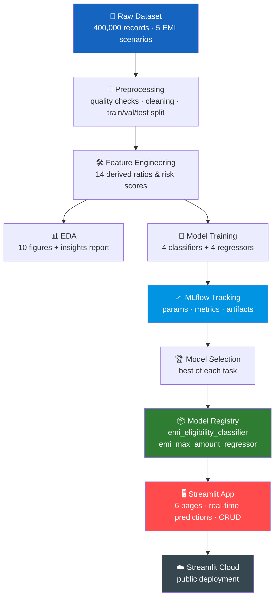
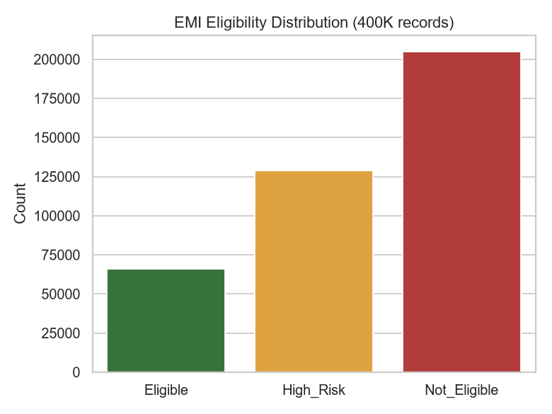
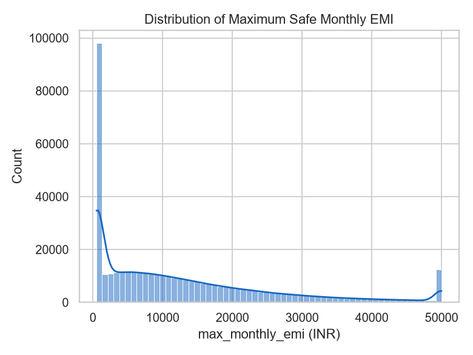
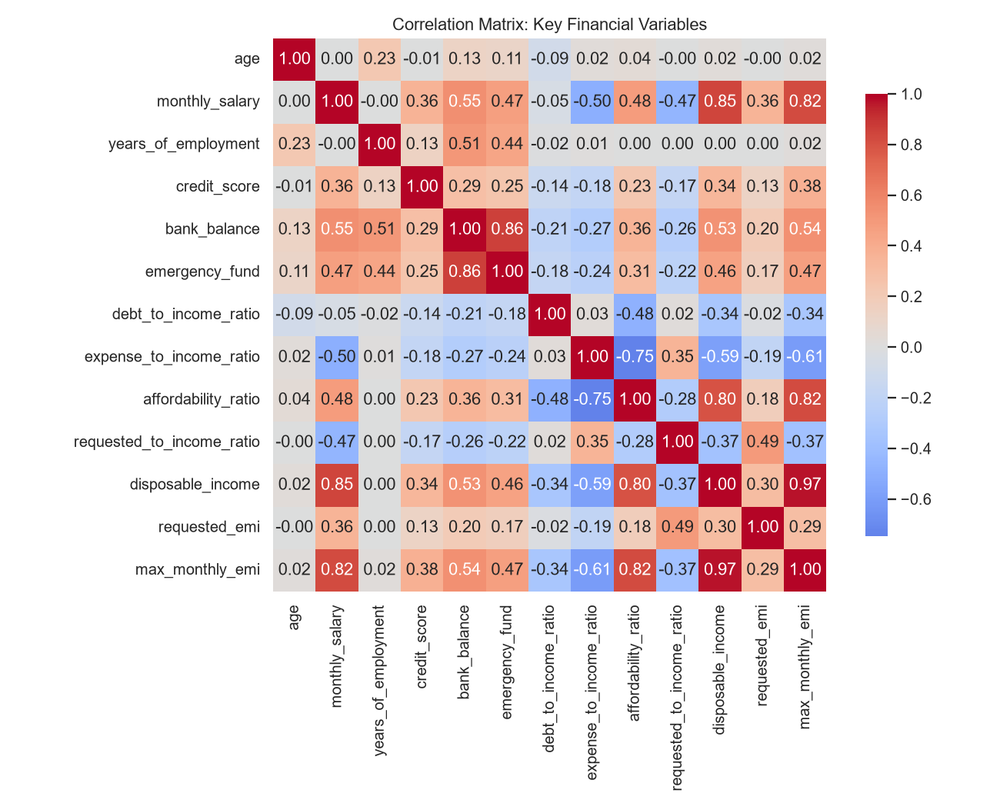
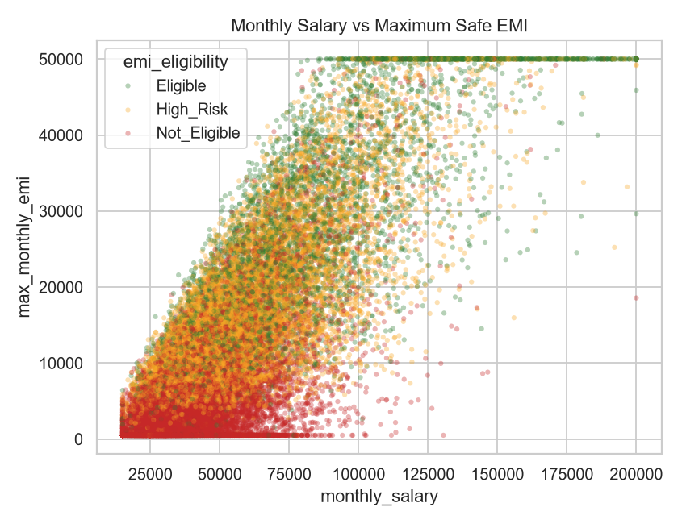
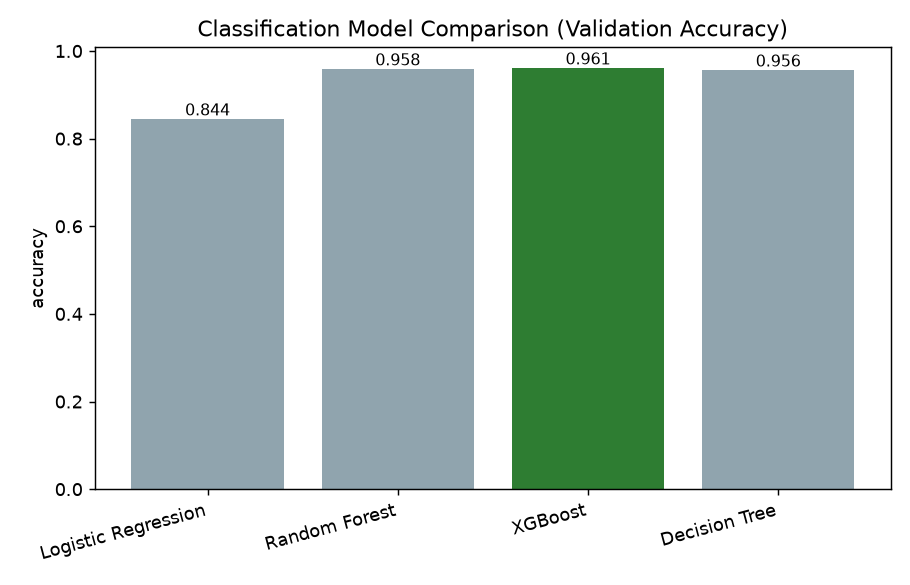
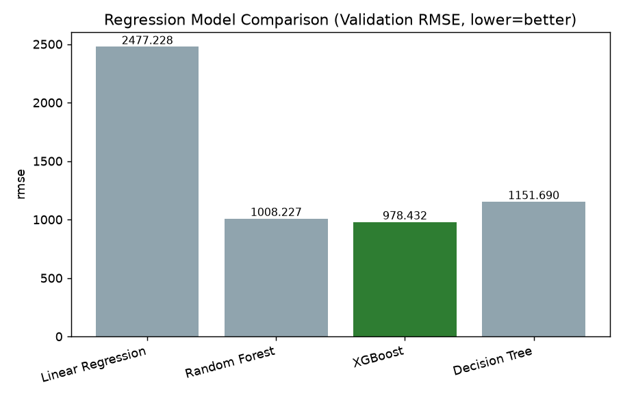
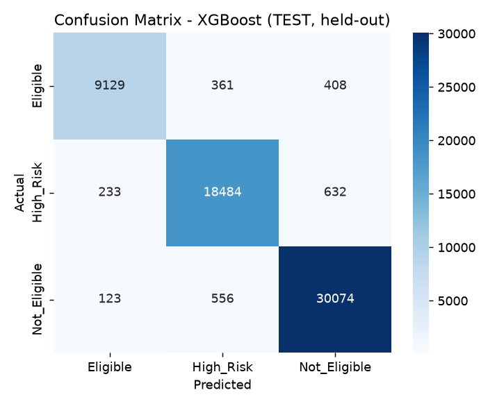
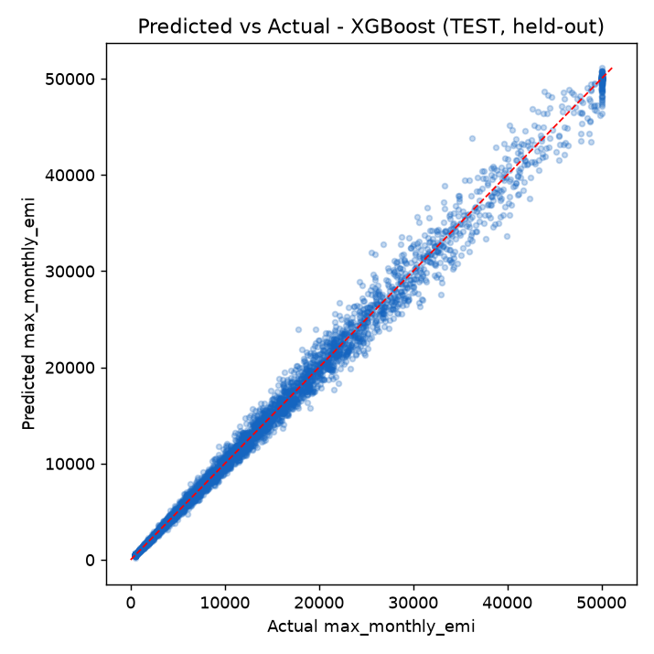

<p align="center">
  
</p>

<p align="center">
  
  
  
  
  
  
  
</p>

<p align="center"><i>An end-to-end FinTech ML platform that predicts <b>EMI eligibility</b> (classification) and the
<b>maximum safe monthly EMI</b> (regression) for loan applicants — with full MLflow experiment
tracking and a production-style Streamlit app.</i></p>

---

## Table of Contents

1. [The problem](#1-the-problem)
2. [What this delivers](#2-what-this-delivers)
3. [Architecture](#3-architecture)
4. [Dataset](#4-dataset)
5. [Feature engineering](#5-feature-engineering)
6. [EDA highlights](#6-eda-highlights)
7. [Modeling & results](#7-modeling--results)
8. [MLflow tracking & model registry](#8-mlflow-tracking--model-registry)
9. [The Streamlit app](#9-the-streamlit-app)
10. [CRUD / Data Management](#10-crud--data-management)
11. [Quickstart](#11-quickstart-local)
12. [Deploying to Streamlit Cloud](#12-deploying-to-streamlit-cloud)
13. [Project structure](#13-project-structure)
14. [Tech stack](#14-tech-stack)

---

## 1. The problem

People frequently take on EMIs — for phones, appliances, vehicles, education —
without a clear picture of what they can actually afford, leading to missed
payments and financial stress. On the lender's side, underwriting is often
manual, slow, and inconsistent across loan officers.

**EMIPredict AI** answers two questions instantly for any applicant:

| Question | ML task | Answer |
|---|---|---|
| *Should this EMI be approved?* | **Classification** | `Eligible` / `High_Risk` / `Not_Eligible` |
| *What's the most they can safely pay per month?* | **Regression** | `max_monthly_emi` (₹) |

**Domain:** FinTech & Banking · **Business impact:** faster underwriting, risk-based pricing instead of blanket declines, standardized eligibility criteria across 5 lending scenarios.

---

## 2. What this delivers

| Requirement | Delivered as |
|---|---|
| Dual ML problem solving (classification + regression) | `src/train_classification.py`, `src/train_regression.py` |
| Real-time risk assessment on 400,000 records | `src/generate_dataset.py` (synthetic, realistic, reproducible) |
| Advanced feature engineering (22+ variables) | `src/feature_engineering.py` |
| ≥3 models per task, compared & justified | 4 models each — see [§7](#7-modeling--results) |
| MLflow experiment tracking + model registry | `sqlite:///mlflow.db` backend, 10 tracked runs + 2 registered models |
| Streamlit Cloud–ready multi-page app | `app/` (6 pages) |
| Complete CRUD for financial data management | `app/pages/5_Data_Management.py` (SQLite-backed) |

---

## 3. Architecture



Both training pipelines and the live app import the **same**
`src/feature_engineering.py` module, so a prediction made in the UI goes
through identical transformation logic to what the models were trained on —
no train/serve skew.

---

## 4. Dataset

No dataset file was supplied with the project brief, so `src/generate_dataset.py`
**synthesizes** 400,000 realistic financial profiles rather than using
arbitrary random data. It builds an underlying financial-capacity simulation —
disposable income, an affordability ratio driven by credit score, job
stability, dependents and savings, plus noise — so the relationships between
features and targets are realistic and *learnable*, not fabricated.

| EMI Scenario | Records | Amount Range | Tenure Range |
|---|---|---|---|
| E-commerce Shopping EMI | 80,000 | ₹10K – ₹200K | 3–24 months |
| Home Appliances EMI | 80,000 | ₹20K – ₹300K | 6–36 months |
| Vehicle EMI | 80,000 | ₹80K – ₹1,500K | 12–84 months |
| Personal Loan EMI | 80,000 | ₹50K – ₹1,000K | 12–60 months |
| Education EMI | 80,000 | ₹50K – ₹500K | 6–48 months |

**22+ input variables** across personal demographics, employment & income,
housing & family, monthly financial obligations, credit history, and loan
application details.

Realistic data-quality issues — missing values, duplicate rows — are injected
intentionally so the preprocessing pipeline has real problems to clean
(see `reports/data_quality_report.json` for the before/after audit).

<p align="center">
  
  
</p>

---

## 5. Feature engineering

Beyond the raw fields, `src/feature_engineering.py` derives 14 features that
mirror real underwriting logic:

- `debt_to_income_ratio`, `expense_to_income_ratio`, `affordability_ratio`
- `requested_emi` — computed from amount/tenure via the standard EMI formula, using a per-scenario interest-rate table
- `requested_burden_ratio` — requested EMI ÷ disposable income (one of the strongest predictors)
- `employment_stability_score`, `emergency_fund_months`, `income_per_dependent`, `credit_score_norm`, and more

---

## 6. EDA highlights

- ~51% of applicants are `Not_Eligible`, ~32% `High_Risk`, ~17% `Eligible` under the simulated risk rules — mirroring real retail-lending books, where most raw applications need pricing adjustment rather than a straight approval.
- Vehicle and Personal Loan EMIs (large ticket, long tenure) show the highest decline rates; E-commerce Shopping EMI (small ticket, short tenure) the highest approval rate.
- Disposable income, salary, and the engineered affordability ratio dominate the regression signal; debt-to-income and expense-to-income ratios are the strongest negative drivers.

<p align="center">
  
  
</p>

Full report with all 10 figures + business recommendations: [`reports/eda_report.md`](reports/eda_report.md)

---

## 7. Modeling & results

4 models were trained **per task** (above the required minimum of 3), with
identical `ColumnTransformer` preprocessing (one-hot + scaling) inside an
sklearn `Pipeline`.

### Classification — EMI Eligibility

| Model | Accuracy | Precision (macro) | Recall (macro) | F1 (macro) | ROC-AUC (OvR) |
|---|---|---|---|---|---|
| Logistic Regression | 0.8442 | 0.8356 | 0.8224 | 0.8279 | 0.9425 |
| Random Forest | 0.9584 | 0.9563 | 0.9498 | 0.9530 | 0.9732 |
| **XGBoost ✅ selected** | **0.9606** | **0.9600** | **0.9508** | **0.9552** | **0.9733** |
| Decision Tree | 0.9557 | 0.9522 | 0.9474 | 0.9498 | 0.9682 |

**Held-out test set (XGBoost):** 96.15% accuracy · F1 0.956 · ROC-AUC 0.974 — comfortably above the project's 90% accuracy target.

### Regression — Maximum Monthly EMI

| Model | RMSE (₹) | MAE (₹) | R² | MAPE |
|---|---|---|---|---|
| Linear Regression | 2,477 | 1,471 | 0.9635 | 56.8% |
| Random Forest | 1,008 | 563 | 0.9939 | 3.9% |
| **XGBoost ✅ selected** | **978** | **557** | **0.9943** | **4.6%** |
| Decision Tree | 1,152 | 639 | 0.9921 | 4.4% |

**Held-out test set (XGBoost):** RMSE ₹972 · R² 0.994 · MAPE 4.5% — well under the project's 2,000 RMSE target.

**Why XGBoost won:** eligibility and affordability are governed by *thresholds and interactions* (e.g. "burden ratio > 0.95 **and** credit score < 600 → high risk"), not straight-line relationships — which is why the linear baselines lag well behind the tree-based models.

<p align="center">
  
  
</p>
<p align="center">
  
  
</p>

Full metrics: [`reports/model_comparison_classification.md`](reports/model_comparison_classification.md) · [`reports/model_comparison_regression.md`](reports/model_comparison_regression.md)

---

## 8. MLflow tracking & model registry

Every training run — hyperparameters, all evaluation metrics, confusion
matrices / prediction-vs-actual plots, feature importance, and the model
artifact itself — is logged to a local MLflow tracking server
(`sqlite:///mlflow.db`). The best model per task is registered to the
**MLflow Model Registry**:

```bash
mlflow ui --backend-store-uri sqlite:///mlflow.db
```

| Registered model | Source experiment | Selected on |
|---|---|---|
| `emi_eligibility_classifier` | `EMI_Eligibility_Classification` | Validation accuracy |
| `emi_max_amount_regressor` | `EMI_MaxAmount_Regression` | Validation RMSE |

The app's **Model Performance** page queries this database live to display
run history alongside the comparison tables above.

---

## 9. The Streamlit app

6 pages, all real-time and backed by the actual trained model pipelines:

| Page | What it does |
|---|---|
| 🏠 **Home** | Overview, live model-availability status |
| 📊 **EDA Dashboard** | Interactive, filterable Plotly charts over the dataset |
| ✅ **Predict Eligibility** | Real-time classification with class-probability chart |
| 💰 **Predict Max EMI** | Real-time regression with an affordability gauge |
| 📈 **Model Performance** | Full model comparison + live MLflow run browser |
| 🗂️ **Data Management** | Full CRUD over stored loan applications |
| ℹ️ **About** | Project overview, architecture, business use cases |

Run it locally:
```bash
streamlit run app/Home.py
```

---

## 10. CRUD / Data Management

The **Data Management** page implements full CRUD over a local SQLite store
(`data/app_data.db`, auto-created):

- **Create** — add a new applicant record; predictions run automatically.
- **Read** — search, filter, and export all stored applications to CSV.
- **Update** — edit a record, optionally re-running predictions on the new data.
- **Delete** — remove a single record or clear the store entirely.

---

## 11. Quickstart (local)

```bash
# 1. Install dependencies
pip install -r requirements.txt

# 2. Generate the 400K-record dataset (~6 seconds)
python src/generate_dataset.py

# 3. Clean, validate, engineer features, and split train/val/test
python src/preprocessing.py

# 4. Run EDA (writes reports/eda_report.md + reports/figures/*.png)
python src/eda.py

# 5. Train & MLflow-track classification models (4 models)
python src/train_classification.py

# 6. Train & MLflow-track regression models (4 models)
python src/train_regression.py

# 7. Launch the app
streamlit run app/Home.py
```

---

## 12. Deploying to Streamlit Cloud

1. Push this repository to GitHub — trained `models/*.pkl` files and
   `reports/` are already committed, so the app works immediately after
   deploy with **no retraining required** on the cloud instance.
2. On [share.streamlit.io](https://share.streamlit.io), create a new app
   pointing at this repo with **main file path**: `app/Home.py`.
3. Streamlit Cloud installs `requirements.txt` automatically and deploys.
4. *(Optional)* To retrain from scratch on a fresh clone, run the pipeline
   scripts from [§11](#11-quickstart-local) before starting the app.

---

## 13. Project structure

```
EMI prediction LABMENTIX/
├── app/
│   ├── Home.py                      # Landing page
│   ├── utils.py                     # Model loading, prediction, CRUD (SQLite)
│   └── pages/
│       ├── 1_EDA_Dashboard.py       # Interactive EDA (Plotly)
│       ├── 2_Predict_Eligibility.py # Real-time classification
│       ├── 3_Predict_Max_EMI.py     # Real-time regression
│       ├── 4_Model_Performance.py   # Model comparison + MLflow runs
│       ├── 5_Data_Management.py     # CRUD for loan applications
│       └── 6_About.py               # Project overview
├── src/
│   ├── generate_dataset.py          # Synthesizes the 400K-record dataset
│   ├── preprocessing.py             # Cleaning, quality checks, train/val/test split
│   ├── feature_engineering.py       # Shared feature logic (training + app)
│   ├── eda.py                       # Figures + markdown EDA report
│   ├── model_utils.py               # Shared pipeline/MLflow/plotting helpers
│   ├── train_classification.py      # 4 classifiers + MLflow tracking + selection
│   └── train_regression.py          # 4 regressors + MLflow tracking + selection
├── data/
│   ├── raw/emi_dataset_sample.csv   # 5,000-row sample (committed, for the EDA page)
│   ├── raw/                         # Full 400K dataset (generated, gitignored)
│   └── processed/                   # train/val/test splits (generated, gitignored)
├── models/                          # Trained pipelines + metadata (committed)
├── reports/                         # EDA report, figures, model comparison reports
├── assets/                          # README graphics
├── requirements.txt
├── .streamlit/config.toml
└── README.md
```

---

## 14. Tech stack

Python · pandas · NumPy · scikit-learn · XGBoost · MLflow · Streamlit ·
Plotly · Matplotlib/Seaborn · SQLite

<p align="center"><sub>EMIPredict AI · FinTech & Banking Capstone Project</sub></p>
