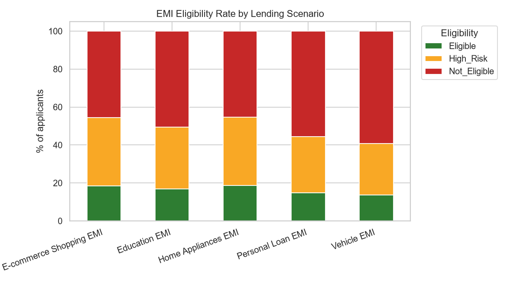
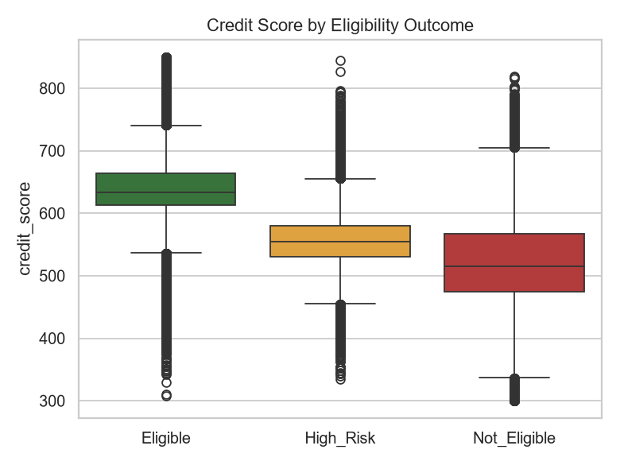
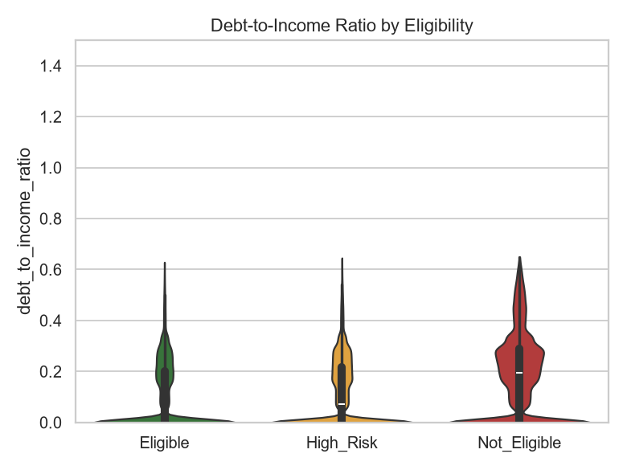
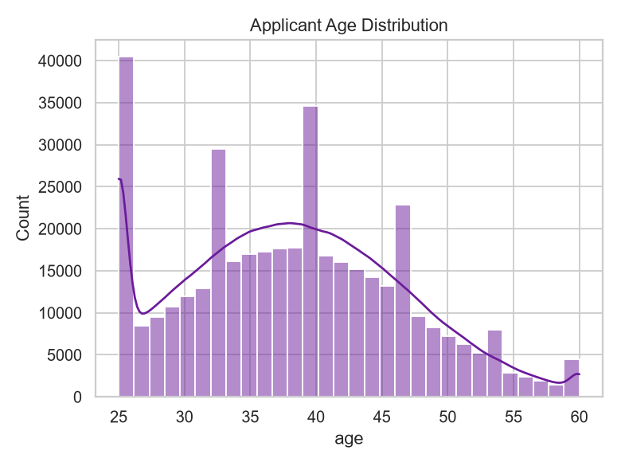
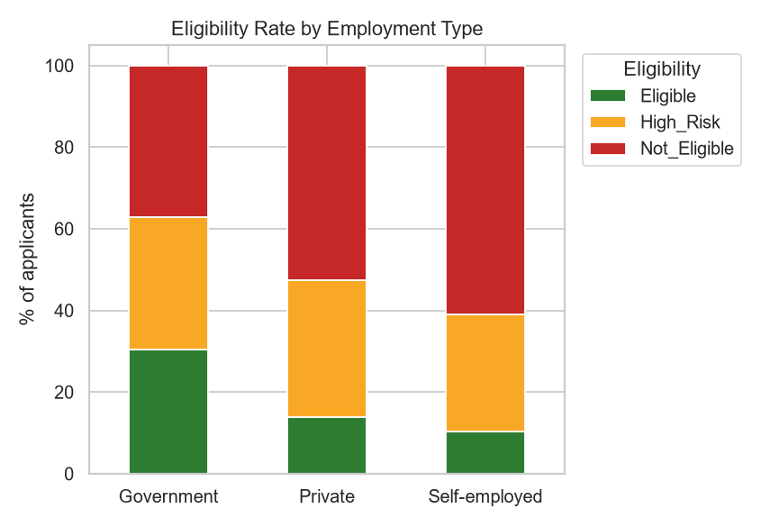
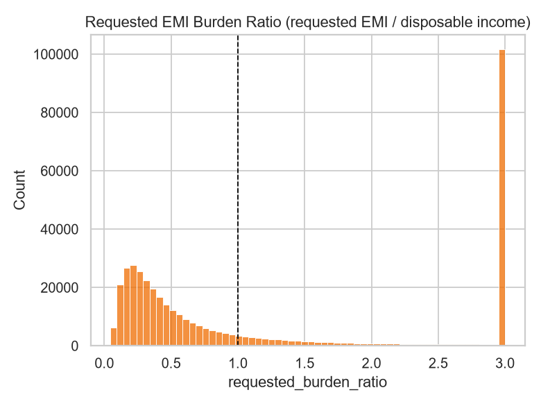

# EMIPredict AI — Exploratory Data Analysis Report

**Dataset:** 400,000 cleaned financial profiles across 5 EMI lending scenarios.

## 1. Target Distribution

- Eligible: **16.5%**
- High Risk: **32.25%**
- Not Eligible: **51.26%**

**Insight:** just over half of applicants are Not Eligible under current risk rules, roughly a third are High Risk (marginal, priced with a higher rate), and ~16-17% are cleanly Eligible. This mirrors real-world unsecured/retail lending books where the bulk of raw applications need risk-based pricing or decline rather than straight approval.

## 2. Maximum Safe Monthly EMI

- Mean: ₹12,620  |  Median: ₹8,867  |  Std Dev: ₹12,926

**Insight:** the distribution is right-skewed — most applicants have modest EMI capacity (median ~₹8-9K/month) while a smaller high-income segment can safely support EMIs above ₹25K, motivating tree-based/boosted regressors over a plain linear model.

## 3. Eligibility by Lending Scenario

**Insight:** Vehicle and Personal Loan EMIs (large ticket sizes, long tenures) show the highest Not-Eligible rates, while E-commerce Shopping EMI (small ticket, short tenure) has the highest approval rate — loan sizing relative to income drives eligibility more than the scenario label itself.

## 4. Correlation Analysis

**Strongest correlations with `max_monthly_emi`:**
- `disposable_income`: +0.972
- `affordability_ratio`: +0.822
- `monthly_salary`: +0.817
- `expense_to_income_ratio`: -0.610
- `bank_balance`: +0.537
- `emergency_fund`: +0.468

**Insight:** disposable income, monthly salary and the engineered affordability_ratio dominate the regression signal, while debt-to-income and expense-to-income ratios are the strongest negative drivers — validating the engineered ratio features.

## 5. Credit Score & Debt Burden

**Insight:** credit score separates the three classes cleanly (median ~640 for Eligible vs ~520 for Not Eligible), and debt-to-income ratio shows the inverse pattern — both are expected to rank among the top feature importances in the classification models.

## 6. Demographic & Employment Patterns

**Insight:** Government employees show the highest approval rates (income + job stability), self-employed applicants the lowest at comparable income, reflecting real underwriting risk premiums for variable-income borrowers.

## 7. Requested EMI Burden

**Insight:** a large share of applicants request an EMI close to or above their disposable income (ratio ≥ 1.0), directly explaining the high Not-Eligible/High-Risk rates and underscoring the value of a pre-qualification tool that sets expectations before formal application.

## Business Recommendations

1. **Pre-qualification widget** for FinTech apps using the regression model to suggest a safe EMI *before* the customer selects a loan amount, reducing decline rates and improving conversion quality.
2. **Risk-based pricing** for the High_Risk segment (~32% of volume) instead of outright decline, capturing revenue that flat cutoff rules would leave on the table.
3. **Scenario-specific underwriting thresholds** for Vehicle/Personal Loan EMI, where ticket size materially exceeds typical disposable income.
4. **Employment-type-aware pricing** to reflect the materially different risk profile of self-employed applicants without blanket exclusion.
